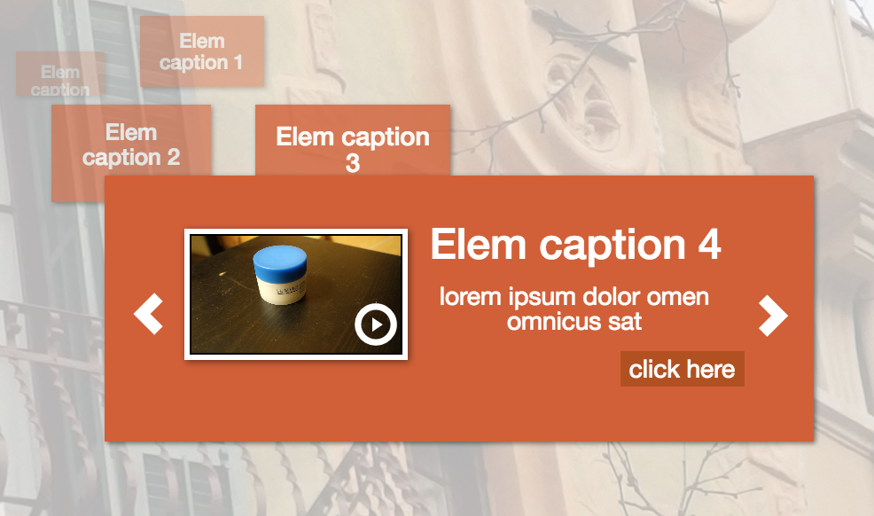

#Html 5 JQuery slider plugin
Plugin provides user controls to change images on the background
[Demo page 1](http://www.pauca-verba.rocks/plugins/html5-slider)
[Demo page 2](demo.html)



```javascript
var $controls = $('.slider-controls');
        $controls.fadeIn();
        $controls.html5Slider({
            containerSelector: '#slider-container',
            elems: elems,
            images: images,
            slideTemplate: $('#slideTemplate').html(),
            elemTemplate: $('#slideControlTemplate').html()
        });
```

Plugin accepts array of elements in the following format:
```
images = [...,
            {
                videoLink: '/assets/sample.mp4',
                header: 'Elem caption 5',
                text: 'lorem ipsum dolor omen omnicus sat',
                link: '#',
                linkText: 'click here',
                slideId: 'slide5'
            }]
```